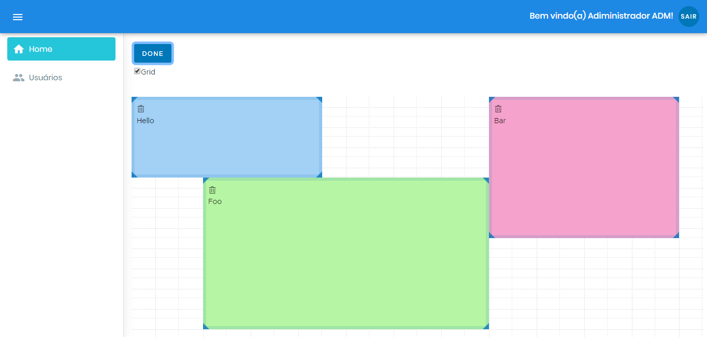

# Django-Angular-ngx-widget-grid

Crud completo, login e dashboard Grid utilizando Django como backend conectando no PostgreSQL 
e Angular como frontend, dashboard com ngx-widget-grid.



## Ferramentas e pacotes:

* [Python 3.7](https://www.python.org/downloads/)

* [Django 3](https://www.djangoproject.com/download/)

``` 
pip install Django==3 
```

* [Node](https://nodejs.org/en/download/)

* [Angular](https://cli.angular.io/)

``` 
npm install -g @angular/cli 
```


# Instalar Projeto

* Criar uma venv

``` 
python -m venv venv 
```

```
venv\Scripts\activate		        #Ativar venv Windows

. venv/bin/activate                     #Ativar venv Linux
```

## Na pasta backend instale os requerimentos do projeto Django.

``` 
pip install -r requirements.txt 
```

* Iniciar backend

``` 
python manage.py runserver 
```


## Na pasta frontend instale os requerimentos projeto Angular.

``` 
npm install 
```

* Iniciar frontend

``` 
ng serve 
```
